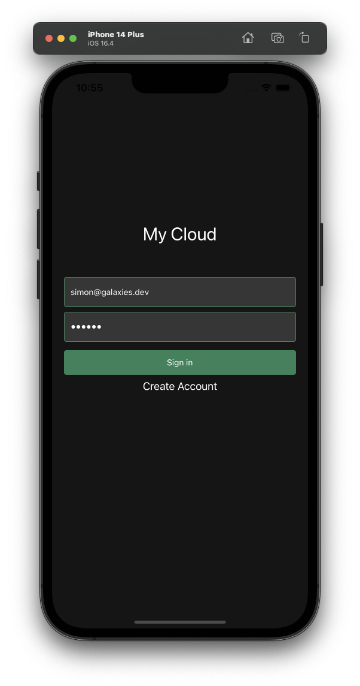
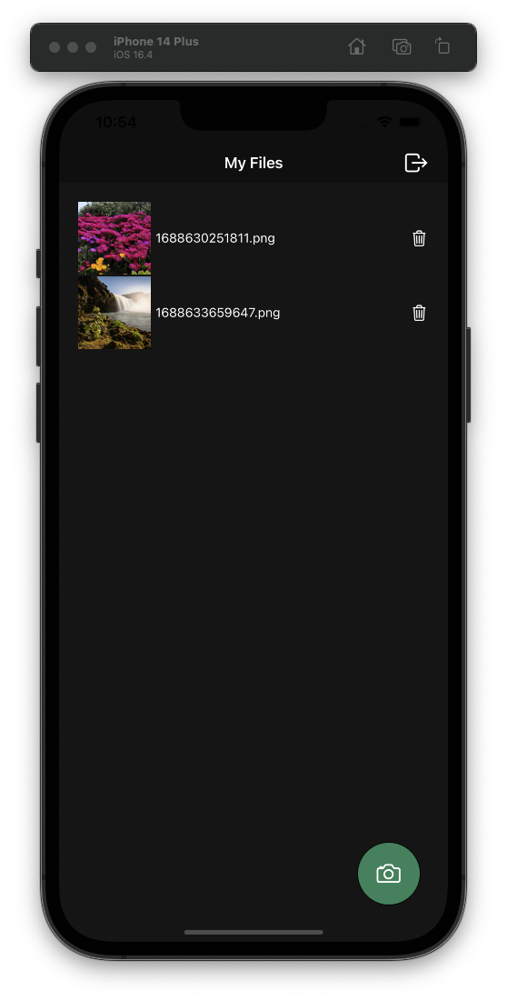
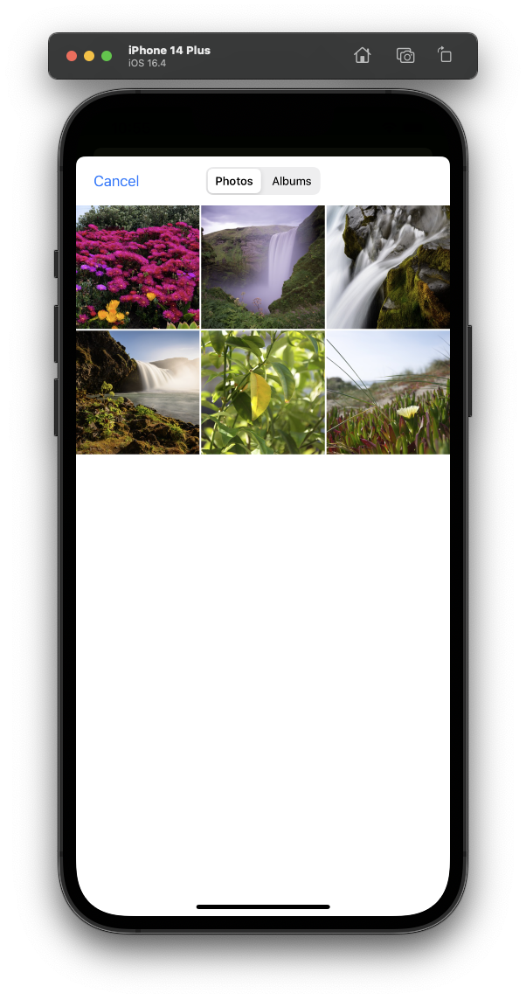

# React Native File Upload with Expo to Supabase Storage

This app is using the [`expo-router`](https://expo.github.io/router) and [Supabase](https://supabase.io) to upload files to Supabase Storage.

Routes are protected by [Supabase Auth](https://supabase.io/docs/guides/auth).

## Configuration

1. Make sure to include your own Supabase keys inside the `config/initSupabase.ts` file.
2. Also create a new bucket `files` inside Supabase Storage, and use the `create-policy.sql` to create a policy that allows users to upload files only to their own folder inside the bucket.

## Running this example

To run the provided example, you can use:

```bash
npm expo start
```

## Preview
<div style="display: flex; flex-direction: 'row';">



</div>